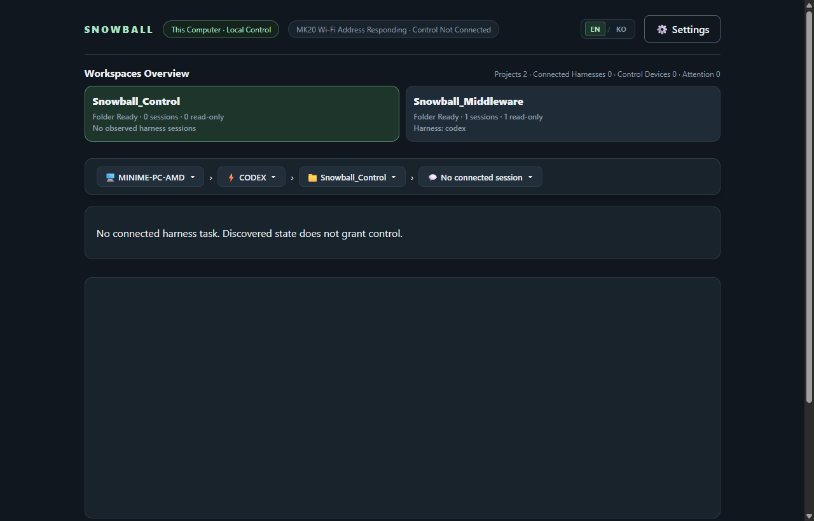
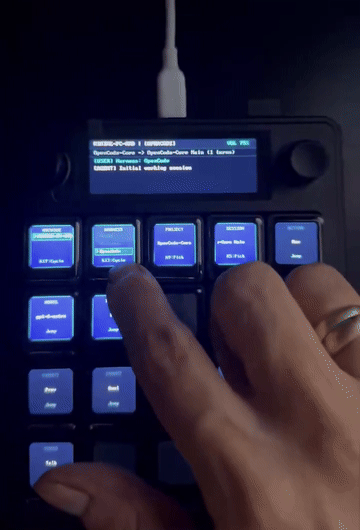

<p align="center">
  
</p>

<h1 align="center">
  
  Snowball Middleware — Preview
</h1>

<p align="center"><strong>One installation for local Web UI, devices and AI harness plugins</strong></p>

<p align="center">
  <a href="README.md">English</a> | <a href="README.ko.md">한국어</a>
</p>

<p align="center">
  <a href="LICENSE"></a>
  
  
  <a href="https://github.com/fkiller/Snowball_Middleware#one-shot-install"></a>
</p>

---

<a id="one-shot-install"></a>
## Install Snowball

**Snowball Middleware is the common installer and PC runtime.** Snowball Control owns the MK20 firmware, HUD and device tools; Snowball Device · M5Stack owns the ESP32 firmware and gateway. Web UI and M5Stack do not require a Control checkout. The three Snowball Harness repositories provide the Codex, Antigravity and OpenCode plugins, included in every profile.

Run **one** command in Windows PowerShell:

| Your setup | Installed together | Command |
| --- | --- | --- |
| MK20 | MK20 runtime + Middleware + all three harness plugins | `& ([scriptblock]::Create((irm 'https://raw.githubusercontent.com/fkiller/Snowball_Middleware/main/install.ps1'))) -Profile mk20` |
| M5Stack + FACES | M5Stack firmware/gateway + Middleware + all three harness plugins | `& ([scriptblock]::Create((irm 'https://raw.githubusercontent.com/fkiller/Snowball_Middleware/main/install.ps1'))) -Profile m5stack` |
| Web UI only | Middleware + all three harness plugins | `& ([scriptblock]::Create((irm 'https://raw.githubusercontent.com/fkiller/Snowball_Middleware/main/install.ps1'))) -Profile web` |

The installer prepares Node/Git (Python for hardware profiles), builds the selected repositories, verifies each isolated plugin's handshake, creates a **Start-Snowball.ps1** launcher and desktop shortcut, then opens **http://127.0.0.1:8765/** after the real API responds. Default location: `%LOCALAPPDATA%\Snowball`. The launcher runs the installed suite again without downloading dependencies.

Connect M5Stack by USB for first installation; flash size is detected, existing flash is backed up privately, and the actual firmware/FACES handshake is checked before enrollment. Connect MK20 to the same private LAN; its guided installer discovers ADB or walks through SD/Wi-Fi bootstrap and the physical QMK DFU step. Keep a full MK20 SD disk image before modifying it. Hardware access/USB reconnects and native harness sign-in require the owner; installed plugins do not fabricate a working provider when its native app is absent.

Options: `-InstallRoot PATH`, `-Serial COMx`, `-Bind PRIVATE_PC_IP`, `-Mk20Address DEVICE_IP:5555`, `-Port 8765`, `-NoStart`, `-NoFlash` (verify an already installed firmware). On ambiguous adapters or USB ports supply the matching option; installation stops on errors. The one-command bootstrap currently targets **Windows**; macOS developers with Node/Git can run `npm run setup -- --profile web` or `--profile m5stack` from a sibling checkout layout. Linux suite workers are not yet supported.

[Common architecture and repository ownership](https://github.com/fkiller/Snowball_Control/blob/main/docs/ARCHITECTURE.md)

[Control · MK20](https://github.com/fkiller/Snowball_Control) · [Middleware · Installer / Web UI](https://github.com/fkiller/Snowball_Middleware) · [Device · M5Stack](https://github.com/fkiller/Snowball_Device_M5Stack) · Harness: [Codex](https://github.com/fkiller/Snowball_Harness_Codex), [Antigravity](https://github.com/fkiller/Snowball_Harness_Antigravity), [OpenCode](https://github.com/fkiller/Snowball_Harness_OpenCode)

---

## 🌟 Overview

**Preview:** Intended exclusively for personal workstations and trusted local networks. The loopback Web UI requires no login or PIN. The omission of authentication/encryption in MK20 UDP and development TCP ADB is detailed in [Current Design and Pre-Release Checklist](docs/ARCHITECTURE.md).

**Snowball Middleware** is the host-side control plane that unifies local AI coding agents—**OpenAI Codex**, **Google Antigravity (AGY)**, and **OpenCode**—into a single, low-latency desktop interface.

It provides developers with:
- **Web Supervisor (`http://127.0.0.1:8765/`)**: Local-loopback dashboard without a login/PIN. Available control operations depend on the native adapters connected to the selected runtime; discovery alone does not grant execution or approval capabilities.
- **Native Desktop System Tray**: Electron tray shell for managing the local runtime. The package builder currently supports Windows and macOS; this review's installed harness baseline is Windows.
- **MK20 Hardware Integration**: Only the MK20 profile loads the companion **Snowball Control** transport and STT library; the Web and M5Stack profiles use the common native-session runtime independently. Native approval, cancellation, and recovery boundaries are defined in the architecture specification.

> 💡 **Looking for MK20 Firmware and Hardware Tooling?**  
> Check out the companion repository: 👉 **[`Snowball_Control`](https://github.com/fkiller/Snowball_Control)** (QMK firmware, Tina Linux OS/BSP, and native C HUD daemon).

---

## 🖥️ Visual Showcase

### Web Supervisor Dashboard
The local-loopback Web Supervisor (`http://127.0.0.1:8765/`) provides zero-cloud oversight, workspace project discovery, active harness monitoring (Codex, AGY, OpenCode), and real-time physical device connectivity:

<p align="center">
  
</p>

### Physical MK20 Terminal Integration
The companion **[`Snowball_Control`](https://github.com/fkiller/Snowball_Control)** repository connects the desktop middleware to the MK20 hardware terminal, featuring physical breadcrumb navigation (`Device > Harness > Project > Session`), built-in mic speech prompt capture, and low-latency display updates:

<p align="center">
  <br>
  <em>Physical MK20 hardware terminal driven by Snowball Middleware.</em><br>
  <a href="https://github.com/fkiller/Snowball_Control">👉 Visit Snowball_Control Repository</a> &nbsp;|&nbsp; <a href="https://x.com/fkiller/status/2099345561627382015">🔗 Original Post on X</a>
</p>

---

## ⚡ Non-Negotiable Core Principles

1. **Zero Simulation**
   - No mock delays, fake approvals, or simulated responses.
   - All session turns, file edits, and tool approvals dispatch directly into native agent runtimes (`codex app-server`, `agy stream-json`, `opencode run`).
2. **Living Source of Truth**
   - Models, efforts (variants), sessions, and workspaces are dynamically discovered from native tools and local caches. Zero static hardcoding.
3. **Local-First & Security Boundary**
   - Web Supervisor runs strictly on `127.0.0.1` loopback with zero mandatory cloud dependencies.
   - Production device transports require their own reviewed pairing. The MK20 lab Preview uses a trusted private LAN and does not provide cryptographic device authentication.
4. **Plugin Sandbox Isolation**
   - Device and harness plugins run in security-isolated sandboxes, preventing arbitrary filesystem access while preserving native host dispatching.

---

## 🏗️ Architecture

For the complete architectural specification, protocol definitions, and security model, see:  
👉 **[`docs/ARCHITECTURE.md`](docs/ARCHITECTURE.md)**

Current component ownership, transport paths, security boundaries and implementation limits are maintained in the [Single Architecture Specification](https://github.com/fkiller/Snowball_Control/blob/main/docs/ARCHITECTURE.md).

---

## 💻 Developer builds and tray shell

### Prerequisites
- **Node.js**: `>= 22.12.0`
- **Current validation**: Windows review host. Automated core tests also run on Ubuntu; Linux Supervisor currently has no default harness survey or native tray package target.

### 1. Setup & Build
```bash
# Clone the repository
git clone https://github.com/fkiller/Snowball_Middleware.git
cd Snowball_Middleware

# Install dependencies
npm ci --ignore-scripts

# Build core packages
npm run build
```

### 2. Running Web Supervisor (Local Loopback)
```bash
npm run start:local
```
Open **`http://127.0.0.1:8765/`** in your browser. The dashboard connects immediately without requiring a login or PIN.

### 3. Running Native Desktop Tray
```bash
# Windows / macOS / Linux System Tray runtime
npm run install:desktop
npm run start:tray
```

### 4. Desktop Packaging (Multi-Platform Releases)
```bash
# Build on the target Windows or macOS host
npm run package:desktop

# (Windows) Build NSIS per-user installer (.exe)
npm run package:windows-installer
```

---

## M5Stack + FACES hardware demo

[](https://github.com/fkiller/Snowball_Device_M5Stack/blob/main/assets/videos/m5stack_navigation_demo.mp4)

[Device firmware and setup](https://github.com/fkiller/Snowball_Device_M5Stack) · [Full MP4 on GitHub](https://github.com/fkiller/Snowball_Device_M5Stack/blob/main/assets/videos/m5stack_navigation_demo.mp4) · [X](https://x.com/fkiller/status/2106892916149158101?s=20)

---

## 🧪 Verification & Test Suite

Run the full automated test suite and inspect its reported pass/skip totals:

```bash
# Run full regression test suite (241 passed)
npm test

# Run desktop tray smoke test
npm run test:tray
```

---

## 📁 Repository Structure

```text
Snowball_Middleware/
├── apps/
│   ├── desktop/                # Electron native tray shell & background worker
│   └── supervisor/             # Web Supervisor UI (HTML, CSS, JS runtime)
├── assets/                     # Official brand artwork, icon, and banner
│   ├── banner.png
│   ├── icon.png
│   ├── screenshots/            # Web Supervisor dashboard & MK20 hardware captures
│   │   ├── web_supervisor_dashboard_en.png
│   │   ├── web_supervisor_dashboard_ko.png
│   │   ├── mk20_navigation_demo.gif
│   │   └── mk20_ui_elements_test.gif
│   └── videos/                 # Demonstration recordings
│       ├── mk20_navigation_demo.mp4
│       └── mk20_ui_elements_test.mp4
├── config/                     # Configuration schemas (STT models, etc.)
├── docs/                       # Comprehensive architecture documentation
│   ├── ARCHITECTURE.md         # English architecture pointer (default)
│   └── ARCHITECTURE.ko.md      # Korean architecture pointer
├── packages/
│   ├── api/                    # Local HTTP & WebSocket API server
│   ├── client-sdk/             # TypeScript client SDK for Supervisor
│   ├── core/                   # State machine, session manager & journal
│   ├── harness-antigravity/    # Antigravity adapter plugin
│   ├── harness-codex/          # Codex adapter plugin
│   └── harness-opencode/       # OpenCode adapter plugin
├── scripts/                    # Build, packaging & test automation scripts
├── LICENSE                     # Apache-2.0 License
├── README.md                   # English project documentation (default)
└── README.ko.md                # Korean project documentation
```

---

## 📄 License

This project is licensed under the Apache License 2.0 - see the [LICENSE](LICENSE) file for details.

Installed tool versions on the review PC are documented in [config/harness-compatibility.json](config/harness-compatibility.json). Recording installed versions does not constitute universal compatibility certification. Use the installed suite launcher above for the complete runtime. `start:local` and the tray are developer entry points that require explicit native adapter configuration.
