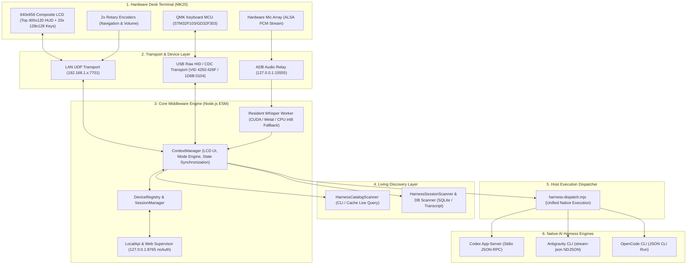
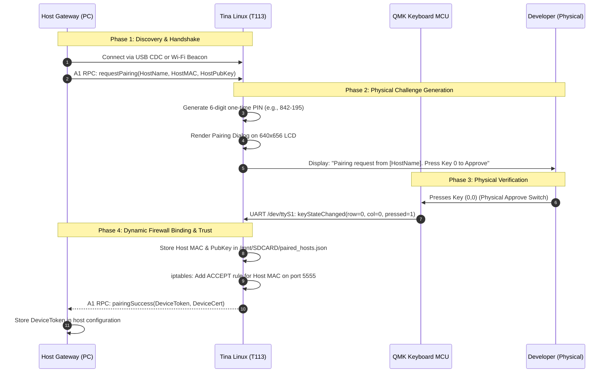
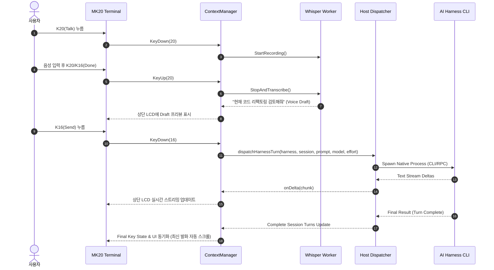
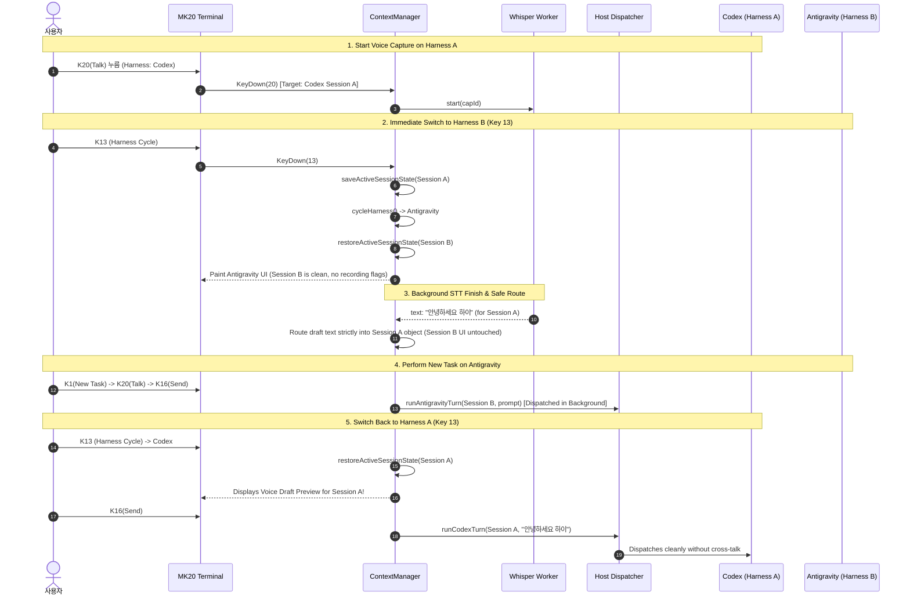

# ARCHITECTURE (전체 시스템 아키텍처 사양서) — Snowball Control & Middleware

## 1. Executive Summary & North Star Vision (개요 및 핵심 비전)

Snowball Control은 올위너 T113(듀얼코어 ARM Cortex-A7)과 QMK 키보드 MCU(STM32/GD32)가 탑재된 하드웨어 데스크 터미널(MK20)을 개발자의 로컬 AI 코딩 전용 물리 제어 패널(HUD)로 탈바꿈시키는 로컬-퍼스트 시스템입니다.

### 불변 원칙: Host-Owned Intelligence
- **호스트 머신(Host)**: 개발 도구, Git 저장소, 언어 서버, AI 에이전트 네이티브 런타임(Codex app-server, Antigravity CLI, OpenCode 등)의 소유자이자 두뇌 역할을 담당합니다.
- **데스크 터미널(MK20)**: 고속 상태 시각화(Display), 오디오 피드백/캡처, 초저지연 물리 키 입력(승인, 거절, 취소, 모드 변경)을 전담하는 씬 클라이언트(Thin Client)입니다.

---

## 2. System Topology Overview (시스템 전체 구조)



---

## 3. Deliverables Organization (산출물 구성)

### 3.1 MK20 하드웨어 3대 산출물 (`mk20-deliverables`)
MK20 하드웨어 터미널은 상호 연동되는 3개의 독립적인 배포 계층으로 구성됩니다:

```text
┌────────────────────────────────────────────────────────────────────────┐
│ 1. QMK Keyboard Firmware (GD32F303 / STM32F103 MCU)                   │
│    - Matrix Scanning (4x5 mechanical keys) + Dual Rotary Encoders      │
│    - Non-Host Standalone Boot (NO_USB_STARTUP_CHECK = yes)             │
│    - Dual-Knob Chord Switching (Host AI Mode ↔ HID PC Typing Mode)     │
│    - Internal UART Framing (/dev/ttyS1, 115200 8N1)                   │
└──────────────────────────────────┬─────────────────────────────────────┘
                                   │ Internal UART Bus (/dev/ttyS1)
┌──────────────────────────────────▼─────────────────────────────────────┐
│ 2. Tina Linux OS & BSP Firmware (Allwinner T113 Dual Cortex-A7)        │
│    - Linux 5.4.61 Kernel + Rootfs (/rom, /overlay)                     │
│    - Hardware Drivers: /dev/fb0 (640x656 LCD), ALSA hw:0,0, Wi-Fi     │
│    - MicroSD Zero-Risk Boot Hook (lunch.sh + dev-access.conf)          │
│    - ConfigFS USB Gadget (CDC ACM serial 1D6B:0104) + TCP ADB (:5555) │
└──────────────────────────────────┬─────────────────────────────────────┘
                                   │ Direct Framebuffer & ALSA Access
┌──────────────────────────────────▼─────────────────────────────────────┐
│ 3. Middleware-Client (Device HUD Daemon: mk20-hud)                     │
│    - Tina Linux Native C Userspace Daemon (/mnt/SDCARD/mk20-hud)       │
│    - 640x656 LCD Rendering (Top 400x120 HUD + 20x 128x128 Keys)       │
│    - D2Coding Glyph Cache & Subpixel Anti-Aliased Curved Key Caps      │
│    - UDP Port 7701 High-Speed JSON State Sync Protocol                 │
│    - Local Hardware Audio Pipeline (voice_rec.sh ALSA 16kHz Mono)      │
└────────────────────────────────────────────────────────────────────────┘
```

| Component | Target Architecture | Location / Artifact | Primary Responsibilities |
|---|---|---|---|
| **1. QMK Firmware** | ARM Cortex-M4/M3 (GD32F303/STM32) | `hardware/mk20/qmk/bin/syk_keyboards_mk20_plus_via.bin` | 20키 매트릭스 스캔, 듀얼 로터리 인코더, VIA 프로토콜, 내부 UART(`/dev/ttyS1`), 비동기 단독 부팅(`NO_USB_STARTUP_CHECK`, `NO_SUSPEND_POWER_DOWN`), 듀얼 노브 HOST ↔ HID 모드 전환. |
| **2. Tina Linux OS & BSP** | ARMv7l Cortex-A7 (Allwinner T113) | Flash Partitions (`/rom`, `/overlay`), `hardware/mk20/dev-tools/` | Linux 커널 5.4.61, USB ConfigFS Gadget (CDC ACM `1D6B:0104`), RTL8188GU Wi-Fi 드라이버, ALSA 오디오 드라이버, MicroSD 부트 훅(`lunch.sh`), TCP ADB(포트 5555). |
| **3. Device HUD Daemon (Middleware-Client)** | Tina Linux Userspace (Native C) | `/mnt/SDCARD/mk20-hud` (`hardware/mk20/hud/`) | 640x656 LCD 프레임버퍼 렌더링(`/dev/fb0`), UDP 7701 프로토콜 서버, 키맵 백업(`/mnt/SDCARD/snowball-keymap.bin`), QMK UART 이벤트 수신 및 호스트 에스컬레이션, ALSA 음성 녹음 제어(`voice_rec.sh`). |

### 3.2 Snowball-Middleware Multi-Platform Host Deliverables (`host/`)
개발자 호스트 머신(Windows / macOS / Linux)에서 실행되는 미들웨어 엔진:

| Component | Implementation | Primary Responsibilities |
|---|---|---|
| **Host Controller Engine** | TypeScript ESM Daemon (`host/src/state/mvp-controller.ts`, `host/src/state/context.ts`) | 세션/프로젝트 관리, 하네스 전환, 키/노브 이벤트 디스패치, 초저지연 프레임버퍼 상태 패킷 직렬화, 음성 드래프트 관리. |
| **Transport Layer** | Node.js UDP Socket (`host/src/transport/udp.ts`) | UDP 7701 포트 양방향 통신, MK20 기기 자동 발견(`SNOWBALL_DEVICE_IP`), 패킷 무결성 검증. |
| **Multi-Platform Audio Transport** | Node.js + ADB Client (`host/src/audio/transport.ts`) | Windows, macOS, Linux 플랫폼별 ADB 경로 자동 탐색, TCP ADB(`:5555`) 세션 연결, MK20 상의 `voice_rec.sh` 배치 및 ALSA PCM 스트림 전송. |
| **Multi-Platform STT Engine** | Python Worker (`host/src/audio/local-whisper.ts`, `host/src/audio/whisper_worker.py`) | 크로스플랫폼 파이썬 런타임 탐색(`.venv-whisper`, `.venv`, `python3`), 하드웨어 가속 자동 감지 (macOS Apple Silicon Metal -> Windows/Linux NVIDIA CUDA -> Vulkan -> CPU int8), JSON-RPC 2.0 stdio 인터페이스. |
| **Living Discovery Adapters** | Native Harness Adapters (`host/src/harness/`) | **OpenCode**: Local HTTP REST & SSE (`:4096`), `opencode` / `opencode.cmd` 자동 감지.<br>**Antigravity**: Windows (`%APPDATA%`), macOS (`Application Support`), Linux (`~/.config`) IDE 스토리지 탐색, `agy` CLI 자동 감지.<br>**Codex**: Windows/macOS/Linux 네이티브 바이너리 자동 탐색, stdio JSON-RPC app-server 연동. |

---

## 4. 계층별 상세 아키텍처 (Detailed Architecture by Layer)

### Layer 1: Hardware Desk Terminal (MK20)
- **Display Architecture (640x656 Framebuffer `/dev/fb0`)**:
  - 물리적으로 단일 640x656 RGB565 LCD 패널을 사용하며, 소프트웨어적으로 상단 HUD와 하단 키 매트릭스로 영역 분할:
    1. **Top Display (HUD / Reader, 400x120)**:
       - 상단 1줄: 호스트 머신명, 활성 하네스, 스피커 볼륨(%), 음소거 상태.
       - 상단 2줄: 현재 작업 프로젝트 및 세션명 (턴 수 표기).
       - 본문 4줄: 에이전트 응답 및 유저 프롬프트(한글 폰트 지원), 세션/모델/파일 브라우저 목록.
       - **텍스트 래핑 및 공백 제거 (`wrapWithPrefix`)**: 빈 줄에서 접두사(`[USER] `, `> `)가 단독 출력되지 않도록 정돈하며, 연속된 3개 이상의 빈 줄을 단일 빈 줄로 압축.
       - **최신 발화 자동 스크롤 (`readerScrollLine`)**: 새 세션/턴 로드 시 뷰포트가 최신 사용자 프롬프트 행 인덱스로 자동 이동하여 수동 스크롤 없이 최신 대화 즉시 표시.
       - **프롬프트 점프 네비게이션**: K19(Prev Prompt) 및 K15(Next Prompt)로 긴 대화 내역 간 유저 질문 위치로 신속 점프.
    2. **Key Matrix Display (4x5 Key LCDs, 각 128x128)**:
       - Row 0 (K20, K16, K12, K8, K4): Voice Talk / Send / Control actions.
       - Row 1 (K18, K14, K10, K6, K2): Model / Effort / Access / View Mode (Files / Changes / Settings).
       - Row 2 (K19, K15, K11, K7, K3): 에디터 활성화 시 다이내믹 선택 버튼 (Item 1~5) 또는 프롬프트 점프 / Diff 토글.
       - Row 3 (K17, K13, K9, K5, K1): Modal Escape / Harness 순환 / Project 선택 / Session 선택 / New Task 생성.
- **Dual Rotary Encoders**:
  - Left Knob: 세션 텍스트 스크롤, 리스트 브라우징, 클릭 시 선택 커밋 / 파일 토글 (MCU 핀 `B5`, 행 100).
  - Right Knob: 볼륨 조절 (0~100%), 클릭 시 음소거 토글 (MCU 핀 `B4`, 행 103).
  - **Dual-Knob Chord Switching (HOST ↔ HID 모드 전환)**:
    - 좌/우 노브 버튼을 동시에 누르면(`g_left_down && g_right_down`) Tina Linux `mk20-hud`가 감지하여 `g_pc_keys_on` 플래그를 토글.
    - **HOST 모드 (`g_pc_keys_on = 0`, 기본값)**: 20개 매트릭스 키코드를 `0x0000 (KC_NO)`로 동적 마스킹하여 PC 타이핑을 억제하고 UART를 통해 Snowball Agent/HUD 제어만 수행.
    - **HID 모드 (`g_pc_keys_on = 1`)**: 원래 팩토리/사용자 키맵(`KC_0` ~ `KC_J`)을 복원하여 PC에 일반 USB 키보드 타이핑 전송과 로컬 HUD 제어를 동시 수행.
- **QMK Keyboard MCU Subsystem (`hardware/mk20/qmk/`)**:
  - **MCU**: STM32F103 / GD32F303 running QMK Firmware + STM32duino DFU Bootloader (`0x4250:0x426F`).
  - **Non-Host / Standalone Boot Fix (`NO_USB_STARTUP_CHECK = yes`, `NO_SUSPEND_POWER_DOWN = yes`)**:
    - 기존 QMK의 USB Host 열거 대기 루프(`while (usbGetDriverStateI != USB_ACTIVE)`)를 우회하여 PC USB 연결 없이 단독 전원 공급 시에도 전원 인가 즉시 매트릭스 스캔 및 내부 UART(`/dev/ttyS1`) 통신 활성화.
    - PC 절전(Suspend)이나 USB 분리 시 MCU 슬립 방지.
  - **Internal UART Bus**: T113 Linux(`/dev/ttyS1`) ↔ QMK MCU 간 115200 8N1 통신. 키 상태 변경 시 `0x16 (id_custom_report_key_state)` 패킷 에스컬레이션.
  - **Keymap Resilience**: `/mnt/SDCARD/snowball-keymap.bin` 저장 및 단독 부팅 시 팩토리 키맵 자동 폴백 복원력 탑재.

### Layer 2: Transport & Device Plugins
- **LAN Transport (`packages/device-lan`, `plugins/device-mk20`)**:
  - UDP 기반 고속 프레임버퍼 전송 (포트 7701).
  - 와이어 포맷: `KeyReportWire` (키 눌림/뗌 이벤트, 플래그), `FramebufferPacket` (압축/비압축 프레임버퍼 데이터그램).
- **USB HID / CDC (`packages/device-hid`)**:
  - QMK 복합 HID (`0x4250:0x426F`): 표준 키보드, 마우스, Raw HID 엔드포인트.
  - USB Gadget CDC ACM (`0x1D6B:0x0104`): 유선 직렬 데이터 채널.
- **ADB Audio Relay**:
  - MK20 내부 T113 리눅스 보드의 ALSA 마이크 스트림을 로컬 포트 `15555`를 통해 16kHz 모노 PCM으로 스트리밍.

### Layer 3: Core Middleware Engine
- **`ContextManager` (`scripts/context-manager.mjs`)**:
  - MK20의 상태 머신 총괄: Harness 전환 -> Scope Key 재계산 -> Project/Session 자동 복원 -> Model/Effort 동적 바인딩 -> 20개 LCD 키 및 상단 LCD 렌더링.
  - 뷰 모드 지원: 기본 대화 뷰, Changes 뷰(24줄 압축 Git Diff), Workspace 뷰(전체 디렉터리 브라우저 및 파일 뷰어), Settings 뷰.
  - **하네스 간 입력 및 백그라운드 태스크 완벽 격리 (Cross-Harness Input & Task Isolation)**:
    - 음성 녹음/전사(`isRecordingVoice`, `voiceDraftText`) 및 AI dispatch 요청은 대상 세션 인스턴스(`targetSessionObj`)에 직접 바인딩.
    - Harness A에서 음성 녹음/전사를 시작하고 즉시 Harness B로 전환(Key 13)해도, Harness A의 백그라운드 전사 및 전송은 고유 세션 컨텍스트 내에서 온전히 완료되며 타 하네스 화면에 교차 오염되지 않음.
    - 하네스 복귀 시 `restoreActiveSessionState()`를 통해 본래의 draft 텍스트와 전송 상태가 100% 복원됨.
  - **새 세션 생성(Key 1) 턴 오염 차단 (Zero Turn Inheritance)**:
    - Key 1 동작 시퀀스: 출발 세션 상태 저장 -> `setSessionTurns([])`로 대화 버퍼 즉시 초기화 -> 신규 `s-*` 세션 unshift -> `selectedSessionIdx = 0` 설정 -> `restoreActiveSessionState()` 호출. (이전 세션의 턴이 신규 세션에 재저장되던 `selectSession(0)` 사이드이펙트 제거).
    - `loadCurrentSessionTurns()` 및 dispatch 완료 시점에도 아직 발송되지 않은 신규 `s-*` 세션은 디스크 캐시나 이전 세션의 `turns`를 절대 상속받지 않고 항상 빈 배열에서 시작.
- **`LocalApi` & Web Supervisor (`packages/api`, `apps/supervisor`)**:
  - `http://127.0.0.1:8765/`: 로컬 전용 웹 UI.
  - 무인증(`noAuth`) 및 PIN 입력 없는 즉각적인 세션 모니터링 및 실시간 설정 (기기 네트워크 페어링 보안과 분리된 로컬 루프백 전용).
- **Multi-Backend STT Engine & Hardware Fallback Graph**:
  - **판정 엔진 (`scripts/assess_stt_backend.py`)**:
    - `START -> Apple Silicon? (Metal) -> NVIDIA? (CUDA Driver + cuBLAS cublas64_12.dll 검증) -> Vulkan -> CPU fallback`.
    - Workstation/서버급 CPU(Threadripper 등 다중 CCD)의 경우 Infinity Fabric 포화를 방지하기 위해 스레드 수를 최적화(최대 16 스레드)로 캡핑.
  - **다계층 의존성 설치기 (`scripts/ensure_stt_runtime.py`)**:
    - 시스템 진단 후 누락된 런타임 DLL(예: CUDA 환경의 `cublas64_12.dll` / `nvidia-cublas-cu12`) 및 백엔드 의존성을 자동 설치하여 전사 에러 원천 차단.
  - **설정 엔진 (`config/stt.json`, `packages/core/src/stt-config.ts`)**:
    - `floor`: 시스템 사양이 낮아도 최소 보장할 모델 (기본값: `small`).
    - `ceiling`: 최상위 허용 모델 (기본값: `large-v3-turbo`).
    - `exclude`: 제외할 모델 목록 (예: `['medium']`).
  - **캐시 및 언인스톨 수명주기**:
    - 모델 캐시: `%APPDATA%\Snowball\Middleware\models` (또는 `~/.cache/snowball/models`).
    - 미들웨어 시작 시 하드웨어 최적 모델 자동 검증/다운로드.
    - 언인스톨러: `keep_data` 시 모델 보존, `remove_all` 시 다운로드된 STT 모델 및 사용자 비밀키 완전 삭제.

### Layer 4: Living Model & Session Discovery
- **`HarnessCatalogScanner` (`scripts/harness-catalog-scanner.mjs`)**:
  - **OpenCode**: `opencode models` CLI 질의 + `~/.cache/opencode/models.json` (46개 모델 및 `reasoning_options` 파싱).
  - **Antigravity**: `agy.exe models` CLI 질의 (14개 모델 및 DisplayName 내 Effort 파싱).
  - **Codex**: 롤아웃 메타데이터 및 RPC 모델 스펙 질의.
- **`HarnessSessionScanner` & `scripts/harness-db-scanner.py`**:
  - **OpenCode**: SQLite DB (`~/.local/share/opencode/opencode.db`) 직접 쿼리.
  - **Codex**: 세션 인덱스 (`~/.codex/session_index.jsonl`) 및 세션 롤아웃 JSONL 파싱.
  - **Antigravity 듀얼 DB 스캔 & 양방향 동기화**:
    - CLI(`agy.exe`) 전용 DB(`~/.gemini/antigravity-cli/conversation_summaries.db`)와 데스크톱 앱 DB(`~/.gemini/antigravity/conversation_summaries.db`)를 동시 스캔.
    - CLI에서 생성된 세션 발견 시 `brain/<cid>` 폴더와 SQLite 레코드를 데스크톱 앱 DB(`app_data_dir = 'antigravity'`)로 자동 동기화하여 Antigravity IDE 앱에서 즉시 노출.
  - **트랜스크립트 정제 (Clean Prompt & Turn Extraction)**:
    - Antigravity `transcript.jsonl` 내부의 시스템 메타데이터(`<\ADDITIONAL_METADATA>`, `<\USER_SETTINGS_CHANGE>`, `<\CONTEXT_SUMMARY>`)를 제거하고, 순수 사용자 프롬프트(`<USER_REQUEST>...</USER_REQUEST>`)만을 정밀 추출하여 MK20 상의 불필요한 줄바꿈 제거.
    - 텍스트가 없는 도구 실행 단계는 `processDetails`로 누적 그룹화하여 빈 에이전트 턴 생성을 차단.

### Layer 5: Host Execution Dispatcher (`scripts/harness-dispatch.mjs`)
- **Codex Runner**: `codex.exe app-server --listen stdio://` 스폰, `thread/start` / `thread/resume` -> `turn/start` 스트리밍.
  - **데스크톱 동기화 (`syncCodexThread`)**: 턴 완료 시 `~/.codex/state_5.sqlite`의 threads 테이블을 업데이트하여 Codex Desktop App에 세션명과 대화가 즉시 반영되도록 보장.
- **Antigravity Runner**: `agy.exe --input-format stream-json --output-format stream-json` 스폰, `step_update.text_delta` 스트리밍 처리.
  - **데스크톱 동기화 (`syncAntigravityConversation`)**: 턴 완료 시 `~/.gemini/antigravity-cli/brain/<cid>`를 `~/.gemini/antigravity/brain/<cid>`로 복사하고 `conversation_summaries.db`를 업데이트하여 Antigravity Desktop App에 세션이 100% 즉시 표시되도록 보장.
- **OpenCode Runner**: `opencode.cmd run --format json --model <model> --dir <cwd> <prompt>` 스폰, 모델 고유 variant(`--variant <variant>`) 자동 매핑. (OpenCode는 CLI와 GUI가 동일한 DB를 공유).

---

## 5. Security & Device Pairing Architecture (Zero-Trust Physical Presence)

### 5.1 Security Threat Model & Security Boundaries
- **로컬 웹 슈퍼바이저 경계**: 개발자 PC 내부 루프백(`127.0.0.1:8765`) 전용이며, 인증/PIN 없이 즉시 열려야 합니다.
- **기기 네트워크 경계 (MK20 Wi-Fi)**: 로컬 Wi-Fi 상의 무인증 접근 위험을 원천 차단하기 위해, MK20 내부 방화벽(`iptables`)은 페어링된 호스트 MAC 주소만 엄격히 인가합니다. 신규 호스트 등록 시 **물리적 존재 증명(Proof of Physical Presence)**을 강제합니다.

### 5.2 Pairing Sequence Diagram



### 5.3 Dynamic Firewall Enforcement
페어링 성공 시 Tina Linux는 동적으로 방화벽 규칙을 추가하며 재부팅 후에도 영구 유지합니다:
```bash
iptables -I INPUT 1 -p tcp --dport 5555 -m mac --mac-source <HOST_MAC> -j ACCEPT
```

---

## 6. Control Planes & Failover Resilience (이중 제어 플레인 및 장애 복구)

```text
+-----------------------+                    +-----------------------+
|                       |  USB CDC / HID     |                       |
|   Developer Host PC   |====================|   MK20 Control Panel  |
|   (Snowball Gateway)  |  (Primary Wired)   |    (Tina Linux OS)    |
|                       |                    |                       |
|                       |  Wi-Fi UDP 7701    |                       |
|                       |  & TCP Port 5555   |                       |
|                       |--------------------|                       |
|                       |  (Firewalled Wi-Fi)|                       |
+-----------------------+                    +-----------------------+
```

1. **Wired Control Plane (USB CDC ACM `1D6B:0104` + QMK HID `4250:426F`)**:
   - 케이블 직접 연결로 지연 없는 직렬 데이터 및 복합 HID 입력 지원.
2. **Wireless Control Plane (Firewalled Wi-Fi UDP 7701 & TCP 5555)**:
   - 포트 5555(ADB/진단) 및 UDP 7701(프레임버퍼 렌더링 및 키 이벤트).
   - 페어링된 호스트 MAC에 대해서만 인가된 전용 무선 채널.
3. **Seamless Failover**:
   - 코딩 턴 진행 중 USB 케이블이 분리되거나 PC가 절전 모드에 진입해도, 키보드 MCU(`NO_SUSPEND_POWER_DOWN = yes`)와 게이트웨이가 즉시 방화벽 인가된 Wi-Fi 링크로 세션 전환을 수행하여 에이전트 승인 대기나 작업 문맥이 끊기지 않습니다.

---

## 7. Data Flow & Execution Sequences (데이터 흐름 및 실행 시퀀스)

### 7.1 Standard Turn Execution Sequence (단일 세션 턴 실행 흐름)



### 7.2 Cross-Harness Switching & Background Task Lifecycle Sequence (하네스 즉시 전환 및 비동기 작업 격리 흐름)



---

## 8. Desktop Tray & Web Supervisor Integration (데스크톱 트레이 및 웹 수퍼바이저 통합)

### 8.1 Windows System Tray Lifecycle & Testability
- **구현 구조 (`apps/desktop/launch.mjs` & `apps/desktop/main.mjs`)**:
  - Windows 알림 영역(System Tray) 아이콘은 Electron 네이티브 셸을 통해 생성됩니다 (`Tray`, `Menu`, `nativeImage`).
  - 일반 개발/데몬 실행(`node scripts/start-all.mjs`)은 터미널 콘솔 프로세스로 직접 구동되므로 Electron GUI 셸이 뜨지 않아 작업 표시줄 트레이 아이콘이 노출되지 않습니다.
  - 실제 트레이 앱으로 실행하려면 `npm run start:tray` (`node apps/desktop/launch.mjs`)를 실행하며, 백그라운드 코어 워커(`core-worker.mjs`)를 Electron 메인 프로세스가 관리합니다.
- **트레이 동작 검증 방법**:
  - **헤드리스 스모크 테스트**: `npm run test:tray` (`node apps/desktop/launch.mjs --smoke-test`)
    - Electron 셸을 테스트 모드로 구동하여 `trayCreated: true`, `mainWindows: 0` (메인 윈도우 없이 백그라운드 상주), `loopbackNoPin: true` (무인증 로컬 루프백), `pauseRoundtrip: true` 상태를 100% 자동 검증하고 안전하게 종료됩니다.
  - **시각적 실물 테스트**: `npm run start:tray`
    - 윈도우 우측 하단 시스템 트레이에 Snowball 아이콘이 생성되며, 우클릭 시 컨텍스트 메뉴(대시보드 열기, 제어 일시정지, 자동 시작 토글, 종료)가 정상 작동합니다.

### 8.2 Web Supervisor (`http://127.0.0.1:8765/`) Zero-Simulation Control Parity
- **No-Auth Local Loopback Boundary (Rule 3)**:
  - 사용자의 로컬 브라우저는 PIN/토큰 입력 없이 `127.0.0.1:8765`를 통해 즉각 대시보드에 접근하여 전체 현황을 모니터링 및 제어합니다.
- **살아있는 원천 기반 동적 하네스 & 모델 카탈로그 반영 (Rule 2)**:
  - `connectedHarnesses`를 통해 Codex, Antigravity, OpenCode 3대 하네스가 즉시 인식됩니다.
  - `POST /v1/harness/models` 엔드포인트를 통해 각 하네스의 실시간 CLI/캐시(`agy.exe models`, `opencode models`, `models_cache.json`)에서 추출된 최신 모델 목록과 해당 모델이 지원하는 Effort 옵션이 동적으로 로드됩니다.
- **실물 제어 동등성 (Interactive Dispatch Parity - Rule 1)**:
  - 웹 대시보드에서 프롬프트를 입력하고 Send(전송)할 경우, `journal.enqueue()` 및 `onCommandQueued` 핸들러를 통해 하네스 네이티브 프로세스(`dispatchHarnessTurn`)로 직접 발주됩니다.
  - 턴 완료 시 `realTurnsData` 및 세션 저장소에 대화 기록이 실시간 축적되며, MK20 하드웨어와 웹 대시보드가 완벽한 양방향 상태 동기화를 이룹니다.

---

## 9. Deployment, Flashing & Multi-Platform Installation Guide (배포, 플래싱 및 멀티플랫폼 설치/실행 가이드)

### 9.1 MK20 하드웨어 3대 산출물 배포 및 설치 절차

```text
               [MK20 하드웨어 터미널]
  ┌───────────────────────┬───────────────────────┐
  │ GD32/STM32 MCU        │ Allwinner T113 Linux  │
  │                       │                       │
  │  [1. QMK Firmware]    │  [2. Tina Linux OS]   │
  │  (Flash 0x08002000)   │  (Flash /rom + MicroSD│
  │                       │   Recovery Hook)      │
  │                       │           │           │
  │                       │  [3. Middleware-      │
  │                       │      Client mk20-hud] │
  │                       │  (/mnt/SDCARD/        │
  │                       │   mk20-hud daemon)    │
  └───────────────────────┴───────────────────────┘
```

#### 1) QMK Firmware (키보드 컨트롤러 MCU)
- **대상 바이너리**: `hardware/mk20/qmk/bin/syk_keyboards_mk20_plus_via.bin`
- **적용 기술**: `NO_USB_STARTUP_CHECK = yes` (비동기 부팅), `NO_SUSPEND_POWER_DOWN = yes` (슬립 방지), 듀얼 노브(Left B5 + Right B4) 코드 스위칭.
- **플래싱 방법 (STM32duino DFU)**:
  1. MK20의 USB 케이블을 PC에서 분리합니다.
  2. 키패드 맨 좌상단 키(Row 0, Col 0 - `KC_0`)를 손가락으로 누른 상태를 유지합니다.
  3. 키를 누른 채 USB 케이블을 PC에 연결하고, 1~2초 후 손을 뗍니다. (기기가 DFU 모드 `1EAF:0003`로 진입).
  4. QMK Toolbox(또는 CLI `dfu-util`)를 실행하여 `syk_keyboards_mk20_plus_via.bin`을 선택하고 **Flash** 버튼을 클릭합니다.
  5. CLI 명령어 예시:
     ```bash
     dfu-util -a 2 -d 1EAF:0003 -R -D hardware/mk20/qmk/bin/syk_keyboards_mk20_plus_via.bin
     ```
  6. 완료 후 USB를 다시 연결하면 독립 전원 및 USB Host 연결 상태 모두에서 키 입력이 즉시 동작합니다.

#### 2) Tina Linux OS & BSP Firmware (Allwinner T113)
- **구성**: Linux 커널 5.4.61 + Tina OS 4.0.0 Flash ROM, MicroSD 런타임 부트 훅.
- **MicroSD 복구 및 부트 훅 배치 (`hardware/mk20/dev-tools/`)**:
  1. FAT32로 포맷된 MicroSD 카드를 준비합니다.
  2. `hardware/mk20/dev-tools/dev-access.conf.example`을 복사하여 `dev-access.conf`를 생성하고, 연결할 2.4GHz Wi-Fi SSID 및 비밀번호, 개발 PC의 MAC 주소를 입력합니다.
  3. `hardware/mk20/dev-tools/lunch.sh`와 `dev-access.conf`를 MicroSD 카드의 루트 디렉터리에 복사합니다.
  4. MicroSD 카드를 MK20 슬롯에 삽입하고 전원을 인가하면, 부팅 시 `lunch.sh`가 자동 실행되어 Wi-Fi 연결, TCP ADB(포트 5555), 방화벽 규칙 적용이 완료됩니다.
- **팩토리 복원**: MicroSD 카드를 분리하고 재부팅하면 기기 내부의 순정 팩토리 상태로 안전하게 복귀합니다.

#### 3) Middleware-Client HUD Daemon (`mk20-hud`)
- **대상 바이너리**: `/mnt/SDCARD/mk20-hud` (C 네이티브 데몬)
- **크로스 컴파일**:
  - 빌드 디렉터리: `hardware/mk20/hud/`
  - Linux/WSL 환경에서 Allwinner T113 GNU 도구체인을 지정하여 빌드:
    ```bash
    cd hardware/mk20/hud
    make clean && make
    ```
- **기기 배포 (ADB 활용)**:
  ```bash
  # 기기 IP 연결 (예: 192.168.1.248:5555)
  adb connect 192.168.1.248:5555
  # 바이너리 및 음성 헬퍼 스크립트 전송
  adb -s 192.168.1.248:5555 push hardware/mk20/hud/mk20-hud /mnt/SDCARD/mk20-hud
  adb -s 192.168.1.248:5555 push hardware/mk20/hud/voice_rec.sh /mnt/SDCARD/voice_rec.sh
  adb -s 192.168.1.248:5555 shell chmod +x /mnt/SDCARD/mk20-hud /mnt/SDCARD/voice_rec.sh
  # 데몬 실행
  adb -s 192.168.1.248:5555 shell "/mnt/SDCARD/mk20-hud > /tmp/hud.log 2>&1 &"
  ```

---

### 9.2 Snowball-Middleware 호스트 플랫폼별 설치 및 실행 가이드

미들웨어 호스트 데몬(`host/`)은 TypeScript 및 Node.js 기반으로 구축되어, Windows, macOS, Linux 3대 플랫폼에서 동일한 기능과 초저지연 성능을 제공합니다.

#### 1) Windows (x64)
- **시스템 요구사항**: Windows 10/11 x64, Node.js 18.x 이상, Python 3.10 이상.
- **권장 가속**: NVIDIA GPU (RTX 시리즈) + CUDA 12.x 드라이버 (`cublas64_12.dll` 자동 탐색).
- **설치 및 실행**:
  ```powershell
  # 1. 저장소 클론 및 이동
  cd host

  # 2. 의존성 설치 및 빌드
  npm install
  npm run build

  # 3. (선택사항) 로컬 Whisper 가상환경 구성
  python -m venv .venv-whisper
  .\.venv-whisper\Scripts\pip install faster-whisper nvidia-cublas-cu12

  # 4. 호스트 데몬 구동
  npm start
  ```
- **하네스 자동 연동**:
  - OpenCode: `opencode.cmd` 자동 탐색.
  - Antigravity: `%LOCALAPPDATA%\agy\bin\agy.exe` 및 `%APPDATA%\Antigravity` 자동 감지.
  - Codex: `%LOCALAPPDATA%\OpenAI\Codex\bin\codex.exe` 자동 감지.

#### 2) macOS (Apple Silicon M-Series & Intel)
- **시스템 요구사항**: macOS 12 Monterey 이상, Node.js 18.x 이상, Python 3.10 이상.
- **하드웨어 가속**: Apple Silicon (M1/M2/M3/M4) 통합 메모리 Metal GPU 가속 자동 활성화.
- **설치 및 실행**:
  ```bash
  # 1. Homebrew를 통한 기본 도구 설치
  brew install node python@3.11 android-platform-tools

  # 2. 저장소 이동 및 빌드
  cd host
  npm install
  npm run build

  # 3. (선택사항) 로컬 Whisper 가상환경 구성
  python3 -m venv .venv-whisper
  ./.venv-whisper/bin/pip install faster-whisper

  # 4. 호스트 데몬 구동
  npm start
  ```
- **하네스 자동 연동**:
  - OpenCode: PATH 상의 `opencode` 자동 탐색.
  - Antigravity: `~/Library/Application Support/Antigravity` 및 `~/.local/bin/agy` 자동 감지.
  - Codex: `/Applications/Codex.app` 및 PATH 상의 `codex` 자동 감지.

#### 3) Linux (Ubuntu / Debian / Fedora / Arch)
- **시스템 요구사항**: Linux Kernel 5.4 이상, Node.js 18.x 이상, Python 3.10 이상.
- **하드웨어 가속**: NVIDIA GPU (CUDA `libcublas.so`), Vulkan, 또는 CPU int8 폴백 자동 선택.
- **설치 및 실행**:
  ```bash
  # 1. 시스템 패키지 설치 (Ubuntu/Debian 예시)
  sudo apt update && sudo apt install -y nodejs npm python3 python3-venv adb git

  # 2. 저장소 이동 및 빌드
  cd host
  npm install
  npm run build

  # 3. (선택사항) 로컬 Whisper 가상환경 구성
  python3 -m venv .venv-whisper
  ./.venv-whisper/bin/pip install faster-whisper

  # 4. 호스트 데몬 구동
  npm start
  ```
- **하네스 자동 연동**:
  - OpenCode: PATH 상의 `opencode` 자동 탐색.
  - Antigravity: `~/.config/Antigravity` 및 `~/.local/bin/agy` 자동 감지.
  - Codex: `~/.local/bin/codex` 및 PATH 상의 `codex` 자동 감지.

