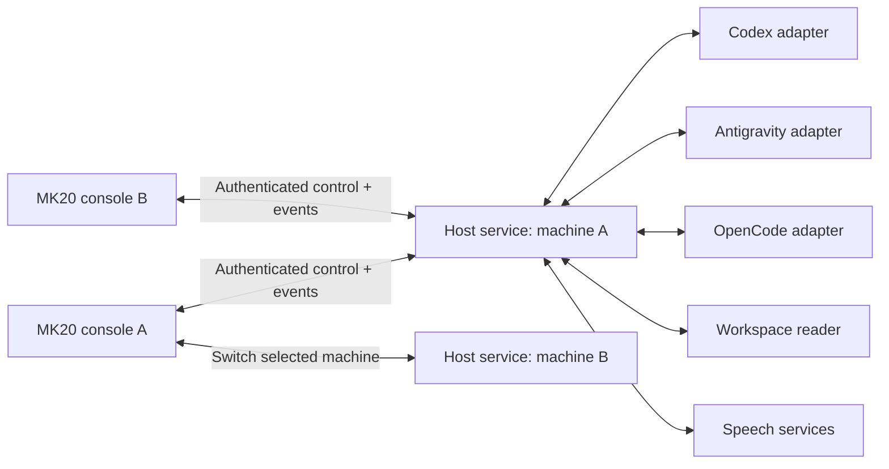

# Snowball Control middleware proposal

**Local-control-first clarification:** [Current execution plan](middleware/PLAN.md) is authoritative for scope and sequencing. Current-PC discovery/control is the default; local-LAN discovery and other-host control are explicit opt-in extensions. Follow [discovery journeys](middleware/DISCOVERY_JOURNEYS.md) and the L0–L5 ledger before implementation.

**2026-09-17 current direction:** [Hardware-independent packaging MVP](MIDDLEWARE_PACKAGING_MVP_2026-09-17.md) defines the proposed separate middleware repository, hardware/harness plugin contracts, tray distribution and API-based Supervisor. It supersedes older packaging and next-step priorities below; current runtime remains the Codex/MK20 prototype until extraction is implemented.

**2026-09-13 active scope:** focus on Codex integration MVP with existing local Whisper STT, reviewed draft and explicit Send. Codex-app audio integration is discontinued. Native-first statements below are historical. See [current state audit and staged plan](CODEX_MVP_PLAN_2026-09-13.md) for actual completion status and the work possible before QMK source arrives.

**2026-09-07 architecture update:** [VOICE_ARCHITECTURE.md](VOICE_ARCHITECTURE.md) is authoritative for audio, discovery and setup; [REVIEW_2026-09-07.md](REVIEW_2026-09-07.md) lists current implementation gaps. Pair MK20 directly once with each host; mDNS supplies discovery hints, authenticated enrollment establishes trust. No peer mesh or mandatory coordinator. The device connects separately to the chosen execution host and chosen speech host, so one installed GPU speech worker can serve five model-free middleware installations (the worker host itself also runs middleware). Native Codex dictation is first choice, not generic STT. Optional CPU worker and OS dictation require explicit setup and capability checks. Prior statements that each selected host performs its own speech conversion are superseded.

**Latest Codex plan:** [CODEX_CAPABILITY_PLAN.md](CODEX_CAPABILITY_PLAN.md) separates product-confirmed features, available interfaces, unverified cross-owner pub/sub, and new audio integration. Native subscription/metadata verification comes before committing to desktop UI automation.

**Concrete connection plan (2026-09-06): [HARNESS_CONNECTIONS.md](HARNESS_CONNECTIONS.md).** Use its surface-specific decisions: Codex owned app-server versus existing-desktop UI bridge versus optional cloud UI, Antigravity Remote Control browser bridge for existing desktop sessions, and OpenCode existing-server HTTP/SSE. The generic native-first comparison below is background and must not override these decisions. UI routes are planned deterministic integrations, not verified public APIs. New host/hardware prototype code is now present; older statements below describing a documentation-only repository baseline are historical.

Interaction contract: [PRODUCT_DESIGN_V2.md](PRODUCT_DESIGN_V2.md) is current. Actual Machine/Harness/Project changes resolve descendants within the new parent scope to remembered valid IDs, otherwise first available resources; do not introduce an artificial empty selection step. Persist last selections by device and parent scope. Configured values and the current editing target are distinct UI states (revision 5). Preserve destination-bound drafts and running tasks. Manual context actions pin the console so automatic following cannot immediately undo the selected context.

Normalize user questions separately from tool approvals. A pending interaction carries native request ID, kind (`singleChoice`, `multiChoice`, `text`, `permission`), question IDs, option IDs/labels, allowed custom input, selection constraints, revision and resolution status. The device groups several physical keys into one option row and submits canonical option IDs, not rendered label fragments. Answer commands bind the owning session and current interaction/layout revision. Late answers to resolved or replaced requests fail. Free-text dictation is an answer operation, not a new prompt. Preserve multiple-question and paging state. Native request-specific adapters own delivery and acknowledgement; do not assume every harness calls this event UserAskQuestion.

Status: design proposal, 2026-09-05. No service, credentials, firewall, provider session, or firmware has been changed by this proposal. Capability descriptions from current online documentation must be tested against installed versions.

## Recommended architecture

Run one user-scoped Snowball host service on each development machine. Connect the MK20 directly to the selected host using a persistent authenticated connection. The host discovers local harness installations and registered projects, owns adapter processes, indexes session metadata, serves workspace content, and performs speech conversion. Multiple MK20 consoles can pair with each host independently.

Use TypeScript on a supported Node.js LTS for the initial host service, with native adapters over persistent stdio/SDK connections. Retain C for the device renderer/input/audio client. A Python adapter sidecar is appropriate only for a harness whose best supported interface requires it. This is a proposal for a new host component; the existing PowerShell diagnostic tools remain useful. Do not modify or vendor the separate Snowball Gateway repository. Decide its integration contract before shipping another executable under the same `snowball-gateway` name; working name here is `snowball-control-host`.

Why this choice: structured adapters and typed event/state handling are the main work, and the initial Codex adapter needs structured protocol orchestration. Keeping orchestration in one process minimizes deployment pieces. Go would suit a small standalone transport binary but add SDK bridges early; a central broker adds another availability and latency dependency. Native C belongs on the constrained device, not in every provider adapter. This is an engineering tradeoff, not a measured language speed comparison.



No mandatory cloud coordinator, message broker, Redis, database server, or browser renderer on the MK20. Use a local SQLite store for host registrations, project IDs, command records, and event cursors; keep private keys in protected storage. Harness stores remain authoritative for their transcripts. An optional remote connection uses an existing VPN or authenticated tunnel; LAN discovery does not cross routed networks automatically.

## Integration order and realistic capability limits

Prefer: native bidirectional protocol/SDK -> supported extension/hooks -> structured CLI stream -> transcript watcher for observation -> explicitly supported browser/accessibility adapter for remaining UI-only actions. Browser scraping is not the primary command transport. Never infer a pending permission from a text sentence if an authoritative permission event exists.

| Harness | Preferred path | What to verify before claiming full support |
|---|---|---|
| Codex | Persistent app-server over local stdio; normalize thread/turn events and server approval requests | Installed protocol schema, model/effort options, saved-history access, and ownership of existing desktop sessions. Do not assume starting another app-server attaches to the desktop's running process. |
| Claude Code | Agent SDK TypeScript session with streamed messages and permission callback/hooks | Sessions list/read/resume, live model/effort settings, exact permission precedence, and whether an existing CLI/IDE session offers a supported control bridge. |
| Gemini CLI | ACP adapter over stdio, negotiate capabilities | Installed ACP version; list/load/config/permission support. Presence of ACP alone does not guarantee all session or effort controls. |
| Antigravity | Assess the installed CLI/SDK separately; structured stream for compatible sessions, supported desktop bridge for existing desktop tasks | Current SDK creates its own runtime; that does not prove attachment to IDE sessions. CLI headless control and permission limits matter. Remote browser access is a possible explicit bridge, not evidence of a public control API. |
| Other harness | Implement the same capability interface | Minimum: observable state and clear limitation badges. Enable prompt/cancel/approval only when the adapter can actually enforce them. |

Codex documents history, streamed events, and request/response approvals in app-server. Its WebSocket transport is labelled experimental; keep that interface local and put Snowball's own authenticated transport in front. Local inspection here found `codex-cli 0.71.0`, whose app-server help differs from current documentation. Generate/inspect schemas from that installed binary in the first adapter spike rather than assuming current web methods exist. [Official Codex app-server documentation](https://learn.chatgpt.com/docs/app-server).

Claude exposes SDK session enumeration/read APIs. Permission decisions can use `canUseTool`, but earlier allow rules or modes may skip it; use the documented hook path where an all-tool gate is required. [Sessions](https://code.claude.com/docs/en/agent-sdk/sessions), [permission evaluation](https://code.claude.com/docs/en/agent-sdk/permissions).

Gemini documents ACP mode, and ACP defines agent-provided configuration options. Discover supported values rather than imposing a universal model/effort enumeration. [Gemini ACP mode](https://geminicli.com/docs/cli/acp-mode/), [ACP configuration](https://agentclientprotocol.com/protocol/v1/session-config-options).

Antigravity's documented headless stream accepts text prompts but rejects control-request/response messages and CLI slash commands; approval-requiring tools may be denied by policy rather than interactively gated. Its Python SDK and browser remote-control feature warrant separate probes. [Headless mode](https://antigravity.google/docs/cli/headless/), [SDK](https://antigravity.google/docs/sdk/overview/), [Remote Control](https://antigravity.google/docs/remote-control/).

A hybrid is useful when roles are explicit: native API for actions, filesystem/official history API for older transcripts, extension for active editor context, browser for a user-visible unsupported desktop workflow. Each fact carries its source and freshness. Do not merge two similarly named sessions or control one process based on another process's transcript. DOM text and workspace content are untrusted data, never service instructions. Avoid reverse-engineered private endpoints or cookies as a product dependency.

## Common model and adapter contract

### Confirmed adapter order and UI focus

Implement Codex first, then Antigravity and OpenCode. Claude and Gemini remain comparison/reference adapters. OpenCode's documented server provides HTTP APIs, an SSE event stream, and a typed SDK; connect to the server owning the selected TUI/web session instead of starting a second unrelated server. Probe the installed version and its OpenAPI contract. [OpenCode server](https://opencode.ai/docs/server/), [SDK](https://opencode.ai/docs/sdk/).

The user requires awareness of the session active in the harness UI, with configurable following. Add a separate `UiFocusProvider` reporting `(hostId, harnessInstanceId, windowId, nativeSessionId, observedAt, source, confidence)`. Prefer an official extension/UI event. Where unavailable, assess a narrow accessibility/browser bridge that observes the focused window and authoritative session identifier. A process being active, a recently changed transcript, or a task still running does not identify the selected UI session. Report unknown rather than guessing. Never read credentials or arbitrary unrelated windows to infer focus. No reviewed documentation establishes universal desktop-focus support; this is an explicit first-adapter spike and may require a harness-specific bridge.

Follow desktop is a console preference; manual selection pins. Freeze auto-follow during draft/recording, approval review, modal browsing, or historical reading. Focus changes never redirect commands already bound to a session, and do not acquire control ownership by themselves. Manual workspace/session navigation remains available if focus observation is unsupported.

Entities: `Host`, `Device`, `HarnessInstance`, `Project`, `WorkspaceRevision`, `Session`, `Turn`, `ContentBlock`, `PendingDecision`, `Draft`, `AudioStream`, and `ControlLease`.

Global session identity is `(hostId, harnessInstanceId, nativeSessionId)`. Project identity includes its registered root and worktree; a path is not globally unique. A host index provides harness-first search across paired hosts, but unavailable hosts are labelled stale. Selecting a new host invalidates incompatible project/session selections visibly and preserves any draft under its old destination.

Adapter operations, exposed only if supported:

```text
probe/version/capabilities
listProjects; listSessions; readSession(cursor); subscribeSession(cursor)
createSession; resumeSession; attachLiveSession
sendPrompt; steerTurn; cancelTurn
listConfiguration; setConfiguration(expectedRevision)
resolveDecision(nativeRequestId, decision)
```

Filesystem browsing and speech are host services, not model calls. Retry sends a new explicit command with a new ID; reconnect does not repeat a prompt automatically. Pause is not a universal substitute for cancel; unsupported pause/resume is disabled.

Capabilities carry supported/read-only/unsupported, reason, allowed values, source version, and update timing (`now`, `nextTurn`, `restart`). Session cards distinguish:

- **Live control:** connected to the authoritative running owner.
- **Resume available:** persisted history can become an owned runtime once safe to resume.
- **View only:** transcript/state is accessible, actions are not.
- **Unavailable:** authentication, host, or protocol missing.

For external sessions, initially observe. Obtain a supported exclusive attachment or owner-approved transfer before sending actions. A Snowball lease coordinates Snowball clients only; it cannot lock another unrelated desktop process. If exclusivity is uncertain, stay view-only or offer an explicitly labelled fork after user intent.

Proposed wire envelope (versioned successor design, not a silent change to `SCHEMA.md`):

```json
{
  "version": 1,
  "kind": "command",
  "id": "unique-command-id",
  "hostId": "paired-host-id",
  "sessionId": "global-session-id",
  "expectedRevision": 42,
  "leaseEpoch": 7,
  "type": "decision.resolve",
  "data": { "decisionId": "pending-request-id", "action": "approveOnce" }
}
```

Commands receive accepted/rejected and eventually completed/failed/unknown results. Events have ordered per-session sequence numbers and stable IDs. Reconnect supplies the last seen cursor; replay bounded deltas or send a snapshot when the cursor is too old. Persist duplicate-command detection. A crash after dispatch but before recording completion is an **unknown outcome** requiring reconciliation, not an exactly-once guarantee or automatic retry.

Approval decisions bind host, harness, session, turn, native request, operation digest/revision, and current lease epoch. The host rejects stale, expired, resolved, or mismatched decisions. UI pressing Approve is not success until the owning harness acknowledges. A host restart reconciles native pending requests before enabling old approval cards.

## Secure pairing, discovery, and multi-device control

**Recommended first enrollment: physical USB, followed by authenticated LAN operation.** It uses an out-of-band channel already present and avoids inventing a six-digit network authentication protocol.

1. Install the user-level host service and explicitly enable pairing on the MK20. Pairing times out and cannot begin from an unsolicited network command.
2. Over USB, exchange host/device public identities and a fresh enrollment challenge. Display host/device identity on both ends and require local host confirmation plus a fresh MK20 keypress. The cable must terminate at the intended host.
3. Bind the received device public key to a narrowly scoped host registration. A per-host local CA may sign a device-generated CSR; the device pins that host identity. Private keys never travel over USB.
4. Connect over mutually authenticated TLS. The host verifies the enrolled client identity; the device verifies its pinned host identity. Neither MAC address nor a visible PIN is an authentication credential.
5. Persist each host-device grant independently. Device removal immediately closes its streams and revokes that registration; other devices keep working. Reset/replacement requires fresh enrollment. Host identity changes require re-pairing.

This enrollment requires a new, versioned device/host handshake; it is not implemented by the existing A1 library. Preserve vendor CDC behavior while prototyping it. Start with user-level software key storage (host OS protections, device restricted files); do not claim hardware-backed protection without a secure element. Physical theft of device storage remains a documented risk.

Use mDNS/DNS-SD for host name, endpoint, protocol version and opaque identity hints; avoid exposing project/session names in advertisements. Discovery is untrusted and cannot authorize reading. Also provide manual address entry for networks that block multicast. [DNS-SD standard](https://www.rfc-editor.org/rfc/rfc6763), [Node TLS client-certificate support](https://nodejs.org/api/tls.html).

LAN-only enrollment can follow using an established PAKE/enrollment library with rate limits, short lifetime, and physical confirmation. Do not implement custom cryptography or accept a six-digit PIN as a bearer token. USB enrollment is the simpler first release.

All paired consoles may observe permitted sessions. One console holds a renewable control lease per session; requests from another console offer an explicit takeover. Lease epochs invalidate delayed commands. Stopping/recording local audio always works locally; stopping a harness requires control authorization. Losing the console does not kill the coding session; pending approvals remain pending or are explicitly denied according to adapter policy, never granted.

Pairing does not grant arbitrary host shell access or expose provider credentials. File reads stay under registered project roots after canonical-path and symlink checks. Reject oversized payloads, traversal and stale file revisions. Protect every product endpoint, including audio; the existing MAC rule on ADB port 5555 is development access only.

## Transport and responsiveness

Use persistent WSS for control/events, small semantic JSON deltas, local rendering, and cached session/project indexes. Establish a separate authenticated binary audio stream when needed so audio cannot queue ahead of Stop or approval responses. Use HTTPS range/paged reads for larger file content, with the same identity and authorization checks. Keep SDK processes warm while sessions are active; bound idle workers.

Start audio with 16 kHz mono 16-bit PCM (32 KB/s before framing) over LAN to simplify capture validation. Add Opus only after measuring Wi-Fi quality/CPU and library availability. The current 115200-baud serial setting cannot carry that raw audio rate. USB control fallback and USB audio are separate deliverables: verify actual CDC throughput before claiming parity. Wi-Fi is the proposed first complete product transport, USB is enrollment/recovery plus later control fallback, and TCP ADB stays development-only. This revises the earlier USB-primary plan and needs explicit adoption before firmware changes.

Prefer client semantic rendering over streaming 21 framebuffer images. Host coalesces text deltas to 20-30 updates/second, prefetches adjacent reader pages, prioritizes decisions/cancel, and bounds queues. No process launch or network request is needed per knob detent. Connection indicators and local sound/mute are device-owned.

Provisional acceptance targets, to measure on actual MK20 and LAN:

| Measurement | Target |
|---|---|
| Key/knob to visible local feedback | p95 <= 50 ms |
| Cached picker opening | p95 <= 100 ms |
| Control acknowledgement on healthy LAN | p95 <= 150 ms, excluding provider execution |
| Host event received to visible device update | p95 <= 100 ms |
| Local mute / stop playback | <= 50 ms |
| Speech recognition and first synthesized audio | Record p50/p95 separately for each speech backend; set targets after audio spike |

Do not label these measured results. Trace device input, host receipt, adapter dispatch, acknowledgement, and render with correlated IDs. Use local monotonic durations and explicit clock offset estimates for cross-machine timings. A small hardware test can validate perceived end-to-end latency.

## First implementation spike

Before a production service: probe installed versions, build one native adapter against its actual generated contract, and demonstrate history -> real prompt -> pending permission -> reject/approve -> cancellation. Validate model/effort changes and pre-existing-session ownership separately. Use an isolated disposable workspace and deterministic tools. Keep provider invocation and permission escalation under explicit test intent; the design review itself does not run live prompts.

Then test authenticated host/device transport with simulated consoles, duplicate commands, process restarts, stale approvals, revoked credentials, and two-controller races. Finally integrate the renderer and audio. See [roadmap](ROADMAP.md).

